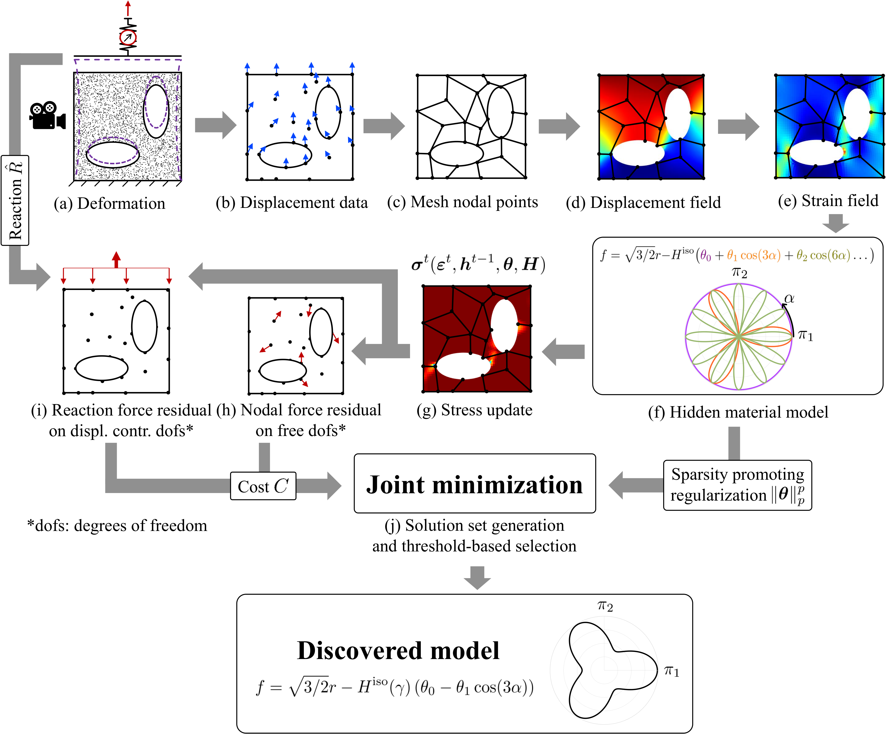

EUCLID (Efficient Unsupervised Constitutive Law Identification & Discovery) is here applied to discover plastic yield functions and hardening laws of different materials.

In a single experiment with complex geometry (a), point-wise displacements
(b) and global reaction forces (i) are measured. A quadrilateral finite element mesh is constructed (c) to interpolate the
displacement data. The resulting displacement field (d) is differentiated to arrive at the strain field (e). The material model
library (f) is constructed (here based on a Fourier ansatz). Based on this library and for given material parameters `theta` and `H`, the
stresses can be calculated by applying a classical elastic predictor - plastic corrector return mapping algorithm at each load step
in the data set, while the history variables are updated at each step (g). Based on the stresses, the internal and external virtual
works and hence the internal (h) and external (i) force imbalances are calculated, contributing to the cost function. Finally,
the cost function is minimized jointly with a sparsity promoting regularization term (j) to generate a set of solutions out of
which a solution with low cost and high parsimony is automatically selected.

# About the documentation
The <a href="https://EUCLID-code.github.io/plasticity/mkdocs/site" target="_blank">documentation</a> contains detailed information for the most important functions (subroutines).
For each function, the _input arguments_ and _output arguments_ are provided.
The documentation can be browsed by using the search box.
The provided _example_ helps to understand the workflow of EUCLID, it can be executed using the code and data provided on <a href="https://github.com/EUCLID-code/plasticity" target="_blank">GitHub</a>.
The data used in the [publication](https://EUCLID-code.github.io/EUCLID-plasticity/mkdocs/site/publication/) can be downloaded from the <a href="https://www.research-collection.ethz.ch/handle/20.500.11850/534002" target="_blank">ETH Research Collection</a>.
